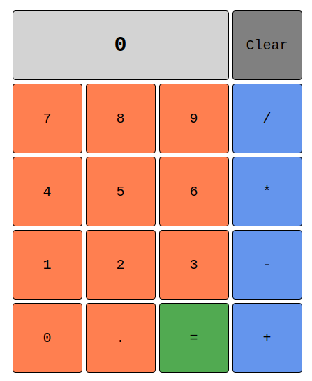

# Calculator

This project is part of **The Odin Project's Foundation curriculum**, where I created a simple **Calculator** application using **HTML**, **CSS**, and **JavaScript**. The calculator supports basic arithmetic operations, allowing users to perform calculations directly in their browser.

## 🌟 Features

- Perform basic arithmetic operations: addition, subtraction, multiplication, and division.
- User-friendly interface with buttons for digits and operations.
- Clear and display results on the same page without refreshing.
- Handle edge cases, such as division by zero and continuous calculations.

## 🚀 Technologies Used

- **HTML5**: For the structure of the calculator interface.
- **CSS**: For styling and layout to create an intuitive user experience.
- **JavaScript**: For the calculator's functionality and interactive behavior.

## 📸 Preview

You can try out the calculator by opening the here: [Live Demo](https://myaccount.github.io/calculator)

## 💡 Learning Outcomes

Through this project, I practiced the following skills:

- Implementing **JavaScript** functions to perform calculations and update the display dynamically.
- Managing state and user input effectively to ensure accurate results.
- Using event listeners to handle user interactions such as button clicks.

---

## 🔗 Acknowledgments

This project was built as part of [The Odin Project](https://www.theodinproject.com/)'s curriculum.
